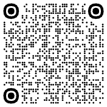

<!--
SPDX-License-Identifier: Apache-2.0
Copyright (c) 2025 Trevor Baker, all rights reserved.
Licensed under the Apache License, Version 2.0 (the "License");
you may not use this file except in compliance with the License.
You may obtain a copy of the License at
  http://www.apache.org/licenses/LICENSE-2.0
Unless required by applicable law or agreed to in writing, software
distributed under the License is distributed on an "AS IS" BASIS,
WITHOUT WARRANTIES OR CONDITIONS OF ANY KIND, either express or implied.
See the License for the specific language governing permissions and
limitations under the License.
-->

# FanSync Home Assistant Integration

[](https://github.com/tjbaker/homeassistant-fansync/actions/workflows/ci.yml)
[](https://codecov.io/gh/tjbaker/homeassistant-fansync)
[](https://github.com/hacs/integration)
[](https://github.com/tjbaker/homeassistant-fansync/blob/main/LICENSE)

Custom Home Assistant integration for Fanimation FanSync devices with cloud push updates, automatic reauthentication, and multi-language support.

**🏆 Quality:** Bronze & Silver tier compliant  
**🌍 Languages:** English, French (Français), Spanish (Español)  
**🔄 Updates:** Real-time cloud push with fallback polling

## Requirements

- **Python:** 3.14+
- **Home Assistant:** 2026.8.0 or newer (HACS enforces this minimum)
- **HACS:** Optional (only if installing via HACS)
- **Account:** Valid Fanimation FanSync account with registered devices

## Features

### Device Control
- **Fan:** On/off, speed, direction, preset modes (normal, fresh_air). Direction is hidden on fans the app marks as not reversible.
- **Light:** On/off, brightness, and color temperature on tunable-white fixtures (fixed-temperature lights stay brightness-only).
- **Home Away** switch: the Fanimation app's Home Away mode, on fans that report it. Turning it on stops the fan; turning the fan on again ends the mode.
- **Light installed** switch on each fan's device page: turn it off on a fan with no light kit to remove its phantom Light entity.
- **Real-time Updates:** Cloud push updates for instant state synchronization
- **Fallback Polling:** Configurable polling when push unavailable (default: 60s)


## Installation

### HACS (Recommended)

1) In Home Assistant, go to HACS → Integrations.
2) Click **Explore & Download Repositories**.
3) Search for "FanSync".
4) Click **Download** and confirm.
5) Restart Home Assistant.
6) Add the integration: Settings → Devices & Services → Add integration → "FanSync".

### Manual

1) Copy `custom_components/fansync/` into your Home Assistant `config/custom_components/` directory.
2) Restart Home Assistant.
3) Add the integration: Settings → Devices & Services → Add integration → "FanSync".

## Removal

Delete the integration under Settings → Devices & Services → FanSync → ⋮ → **Delete**. Then remove the code: in HACS, remove FanSync from HACS → Integrations; for a manual install, delete `config/custom_components/fansync/`. Restart Home Assistant.

## Configuration

| Option      | Description                                                  | Default |
|-------------|--------------------------------------------------------------|---------|
| Email       | FanSync account email                                        | –       |
| Password    | FanSync account password                                     | –       |
| Verify SSL  | Verify HTTPS certificates when connecting to FanSync cloud   | True    |
| HTTP timeout (s) | HTTP connect/read timeout used during login/token refresh     | 20      |
| WebSocket timeout (s) | WebSocket connect/recv timeout for realtime channel         | 30      |


### Options

Push-first updates are used by default. A low-frequency fallback poll can be configured:

| Option                 | Description                                                       | Default |
|------------------------|-------------------------------------------------------------------|---------|
| fallback_poll_seconds  | Poll interval in seconds when push is unavailable (0 disables polling). | 60      |
| http_timeout_seconds   | HTTP connect/read timeout (seconds)                               | 20      |
| ws_timeout_seconds     | WebSocket connect/recv timeout (seconds)                          | 30      |
| lightless_devices      | Per-fan: select any fans with no physical light to hide their Light entity (see below). | none    |

Set via: Settings → Devices & Services → FanSync → Configure → Options.
- Poll interval allowed range: 15–600 seconds (0 disables polling and relies on push)
- **Fans with no light** is a per-fan selection, so in a multi-fan account you can hide the phantom Light on only the fans that lack one. The same setting is available per fan as the **Light installed** switch on the fan's device page. Changes apply immediately without a reload.
- Timeout ranges: 5–120 seconds (HTTP and WebSocket)

## Reauthentication

If your FanSync credentials expire or become invalid, Home Assistant will automatically prompt you to re-enter your password:

1. A notification will appear: "FanSync requires re-authentication"
2. Click the notification or go to **Settings** → **Devices & Services** → **FanSync**
3. Click **Configure** → **Re-authenticate**
4. Enter your password (email is pre-filled)
5. The integration will reconnect automatically

Your devices and automations remain unchanged during reauthentication.

## Languages

The integration UI is available in multiple languages:
- 🇬🇧 **English** (en)
- 🇫🇷 **French** (Français)
- 🇪🇸 **Spanish** (Español)

The UI language follows your Home Assistant language setting. To change:
1. Go to your **User Profile** (bottom left)
2. Select **Language**
3. Choose your preferred language
4. Refresh the page

## Troubleshooting

### Quick Diagnostic Steps

If you're experiencing connection or device control issues, follow these steps:

#### 1. Get Diagnostics (Fastest!)

The integration captures comprehensive diagnostics **even when setup fails**!

**If integration is working:**
1. Go to **Settings** → **Devices & Services**
2. Find the **FanSync** integration
3. Click the **three dots (⋮)** menu
4. Select **Download Diagnostics**
5. Save the JSON file

**If setup fails:**
Diagnostics are automatically logged! Look for:
- Error message in UI shows key metrics: `HTTP: XXXms, WS handshake: XXms, Login wait: XXXms`
- Full diagnostics in logs: Search for "Connection diagnostics (structured)" message
- Copy the entire JSON block from the logs

**What's included** (no passwords or tokens):
- **Connection**: HTTP login, WebSocket handshake and login timing; token metadata; last login response; recent failure history; latency, timeout, reconnect and push metrics
- **Devices**: profiles (model, firmware) and cloud metadata; `status_snapshot` with the raw protocol registers; `observed_values`, the distinct values each device has actually reported per register (this is how a fan's real speed levels or a light's color presets show up)
- **Commands**: recent set/get history with latency
- **Environment**: Home Assistant, Python and library versions

**Share this file when reporting issues.** It covers most connection and device-behavior questions without a debug log.

#### 2. Enable Debug Logging

The integration's own logger covers every module (client, coordinator, entities). Add the two network libraries only for login or connection problems.

**Temporary** (Developer Tools → Actions):
```yaml
action: logger.set_level
data:
  custom_components.fansync: debug
  httpx: debug        # HTTP login and token refresh
  websockets: debug   # WebSocket connection and server messages
```

**Persistent** (`configuration.yaml`, then restart):
```yaml
logger:
  default: info
  logs:
    custom_components.fansync: debug
    httpx: debug
    websockets: debug
```

Reproduce the issue, then read the log under **Settings** → **System** → **Logs**. Note that the `websockets` logger prints the login token and session cookie; trim those before posting a log publicly.

**Note**: If setup fails, the integration automatically logs structured diagnostics at ERROR level, so debug logging is optional but helpful for additional context.

### Common Issues

#### Connection Timeout During Setup

**Symptoms**: Integration setup hangs for 90 seconds then fails with "WebSocket connection failed"

**Diagnostics to check**:
- `connection_timing.last_http_login_ms` - HTTP authentication timing (should be < 5000ms)
- `connection_timing.last_ws_connect_ms` - WebSocket handshake timing (should be < 5000ms)
- `connection_timing.last_ws_login_wait_ms` - Time waiting for login response (> 80000ms indicates server not responding)
- `connection_timing.last_ws_login_ms` - Total WebSocket connection time (> 80000ms indicates timeout)
- `last_login_response` - Last login response from server (null if no response received)
- `connection_failures` - Recent failure history with exact error types
- `token_metadata.is_expired` - Token expiration status

**Possible causes**:
1. **Firewall blocking WebSocket (wss://)** - Check if HTTP succeeds but WebSocket fails
2. **Server-side issue** - If token is valid but server doesn't respond to WebSocket login
3. **Network restrictions** - Corporate/enterprise networks may block WebSocket protocol

**Solutions**:
- Verify the official Fanimation mobile app works on the same network
- Check firewall rules for `wss://fanimation.apps.exosite.io:443`
- Try from a different network (e.g., mobile hotspot) to rule out local network issues
- Check diagnostics for `connection_failures` to see error patterns

#### Devices Not Responding to Commands

**Symptoms**: Fan/light entities show up but don't respond to commands

**Diagnostics to check**:
- `metrics.timeout_rate` - High timeout rate indicates network latency
- `metrics.avg_latency_ms` - Average command latency (should be < 2000ms)
- `metrics.websocket_reconnects` - Frequent reconnects indicate unstable connection
- `connection_analysis.quality` - Overall connection quality assessment

**Solutions**:
- If `avg_latency_ms > 5000`: Increase WebSocket timeout in integration options
- If `websocket_reconnects > 10`: Check WiFi signal strength and network stability
- If `timeout_rate > 0.3`: Network latency issues - check router/ISP

#### A Light Entity Appears for a Fan With No Light

**Symptoms**: A `light.*` entity is created (and may show in the Fanimation app too) even though your fan has no physical light. Controlling it does nothing.

**Cause**: Some fans (e.g. certain Kute60 units) advertise a light channel in their cloud status despite having no bulb. The integration creates the Light entity from that reported channel, so it cannot tell a real light from a phantom one.

**Automatic detection**: If you told the official Fanimation app that your fan has no light kit, the cloud marks the device accordingly (`hideLightDimmer`) and the integration hides the Light entity automatically — no configuration needed.

**Manual option**: If the app was never told (the flag is only set when you configure it there), open the fan's device page (Settings → Devices & Services → FanSync → the fan) and turn off the **Light installed** switch under *Configuration*. That fan's Light entity is removed immediately, with no reload; turn the switch back on to restore it. The same setting is also available for all fans at once under the integration's Configure → Options → **Fans with no light**. Other fans that do have lights are unaffected. If you believe your fan *does* have a light that isn't working, please [open an issue](https://github.com/tjbaker/homeassistant-fansync/issues) with a downloaded diagnostics file so we can investigate device capabilities.

#### The Speed Slider Jumps to a Different Value

**Symptoms**: You set a speed such as 87% and a couple of seconds later Home Assistant shows 80%.

**Cause**: Some fans only hold a fixed set of speeds. The controller accepts any value, snaps it to one of its levels, and reports that back; Home Assistant shows what the fan settled on. A Kute60, for example, holds 20/35/50/65/80/100 and rounds a request *down*, so 97% gives med high and only 100% gives high. The distinct values a fan has reported appear under `coordinator.observed_values` in a diagnostics download.

#### The Fanimation App Shows the Fan On After Home Assistant Turned It Off

**Symptoms**: You turn the fan off in Home Assistant, the fan stops and Home Assistant shows it off, but the Fanimation app still shows it on.

**Cause**: Some fans (a Kute60, for example) obey a power-off but never report it to Fanimation's cloud, which is where the app reads from. Home Assistant relies on the fan's own acknowledgement of the command instead. The app catches up the next time the fan reports anything, such as a speed change. Restarting Home Assistant makes it re-read the cloud, so the fan can show as on until the next command; fans kept this way are listed under `coordinator.assumed_values` in a diagnostics download.

#### A Fan You No Longer Own Still Shows as a Device

**Symptoms**: A FanSync device with no entities lingers under Settings → Devices & Services, typically a fan that was removed from the Fanimation account or left at a previous home.

**What to do**: Open the device page, click ⋮ → **Delete device**. The integration allows deletion for any device the account no longer lists; a device that is still in the account is refused, since it would be recreated on the next start.

#### Changing Fan Direction Does Nothing

**Symptoms**: Setting the fan to reverse in Home Assistant is accepted (no error), but the fan keeps spinning forward and the direction snaps back a few seconds later. Reversing in the official Fanimation app may not work either; you may hear the receiver click.

**Cause**: The FanSync cloud accepts the reverse command and forwards it to the receiver, but the receiver reports that the direction did not change. This is a hardware limitation, most often a universal add-on receiver (e.g. `FanSync-UAR1L2`) installed in a third-party fan whose motor cannot be reversed by the receiver. Debug logs show the `set` with `H06: 1` acknowledged, followed by a `device_change` push with `H06: 0`. The integration sends exactly what the app sends; there is nothing it can do differently.

**What to do**: Check whether the fan has a physical reverse switch on the housing, and confirm with Fanimation support that the receiver can reverse your fan's motor. If you tell the Fanimation app the fan is not reversible, the cloud marks the device (`hideFanDirection`) and the integration hides the direction control for that fan automatically on the next reload.

#### Intermittent Disconnections

**Symptoms**: Integration works but disconnects randomly

**Diagnostics to check**:
- `metrics.websocket_reconnects` - Count of reconnection attempts
- `metrics.push_updates_received` - Push update reliability
- `connection_failures` - Timestamps and patterns of failures

**Solutions**:
- Check `connection_failures` for patterns (time of day, specific error types)
- Verify Home Assistant has stable network connection
- Check for router/firewall idle timeout settings (may disconnect long-running WebSocket)

#### Authentication Failures

**Symptoms**: Notification that "FanSync requires re-authentication" or integration shows as "Authentication Failed"

**What happens automatically**:
- The integration detects expired or invalid credentials (401/403 HTTP errors)
- Home Assistant triggers the reauthentication flow
- You'll see a notification to re-enter your password

**To resolve**:
1. Click the notification or go to **Settings** → **Devices & Services** → **FanSync**
2. Click **Configure** → **Re-authenticate**
3. Enter your password (email is pre-filled)
4. Integration reconnects automatically

**Note**: This is normal if you changed your FanSync password or if the session expired. Your devices and automations are unaffected.

### Reporting Issues

When reporting connection issues, please:

1. **Download and attach diagnostics** (see above) - this is the most important step!
2. Include Home Assistant version and installation type (OS/Container/Core)
3. Describe your network environment (home/corporate, VPN, proxy, etc.)
4. Note if the official Fanimation app works on the same network
5. Include debug logs showing the connection attempt

Use the [Connection Issue template](https://github.com/tjbaker/homeassistant-fansync/issues/new/choose) which guides you through providing all necessary information.

For general contributing guidelines, see [CONTRIBUTING.md](CONTRIBUTING.md).  
For detailed test suite info, see [tests/README.md](tests/README.md).

## Development & Contributing

Want to contribute or test changes locally?

### 🚀 Quick Start: Docker Development

Get a local Home Assistant instance running in seconds:

```bash
make docker-up            # Start HA with your code mounted, at http://localhost:8123
# No login after first setup. Edit code, then:
make docker-restart       # See changes in ~10 seconds
make docker-logs          # Follow the integration's loggers
make docker-logs FILTER='fansync|websockets'   # ...or any loggers, by name
```

Run `make help` for every target, including `docker-reset` for a clean slate.

### 🧰 Local Dev (Virtualenv + Make)

If you prefer to run checks outside Docker:

```bash
make venv
make install
make check
```

### 📚 Contributing Guide

See **[CONTRIBUTING.md](CONTRIBUTING.md)** for:
- Complete Docker setup and workflow
- Code standards and conventions
- Pull request process
- Testing guidelines

For test-specific details, see **[tests/README.md](tests/README.md)**.

## Quality & Testing

This integration follows Home Assistant's Integration Quality Scale:

- ✅ **Bronze Tier:** Complete (8/8 requirements)
- ✅ **Silver Tier:** Complete (4/4 requirements)  
- 🔄 **Gold Tier:** In progress (coverage target 95%)

**Test Suite:** coverage and test counts are tracked in CI:
- See the Codecov badge for current coverage
- See the CI workflow for the latest test count

Coverage and test counts are intentionally not hard-coded here to avoid drift.

**Tests cover:**
- Entity functionality (fan, light)
- Push updates and optimistic updates
- Connection handling and retries
- Configuration and options flows
- Reauthentication flows
- Error handling and edge cases

**Run tests locally:**
```bash
make coverage
```

See [QUALITY_SCALE_VERIFICATION.md](QUALITY_SCALE_VERIFICATION.md) for detailed compliance report.

## Support This Project

If you find this integration useful, please consider:

⭐ **Star this repository** on GitHub  
🐛 **Report issues** or suggest features  
🔧 **Contribute** improvements or translations  

And if you'd like to buy me a coffee ☕:

**💙 USDC on Base Network**

<p align="center">
  
</p>

**Address**: `0x7CC11505c5fBb8FB0c52d2f63fd9A44763246397`  
**Network**: Base (not Ethereum mainnet)

*Completely optional! This project is free and open source.* ❤️

 

## License

Apache-2.0 (see [LICENSE](LICENSE)).

## Acknowledgments

- Reverse‑engineering notes and sample payloads that informed this work were
  originally published in [rotinom/fansync](https://github.com/rotinom/fansync).
